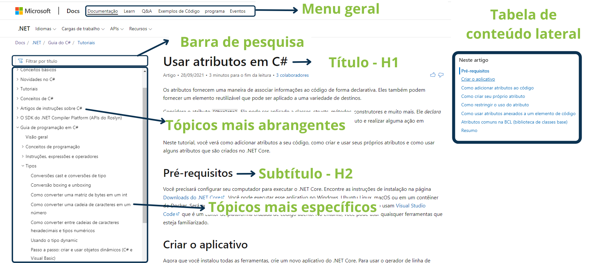

# Arquitetura da informação

Proponho uma estruturação das informações em que há um tópico macro que contém as informações gerais do assunto, ou seja, tópicos mais abrangentes, e dentro deles tópicos mais específicos, respeitando a taxonomia e a hierarquia das informações.
 Além disso, uma tabela de conteúdo lateral direito, para que o usuário se localize quando o documento for extenso, e também um menu lateral esquerdo com os tópicos. 
 E, na página respeitar a hierarquia da informação, título principal - H1, e o subtítulo - H2.

 Ainda no portal de documentação, é importante ter uma barra de pesquisa para facilitar a localização de documentos.

 A seguir o site da Microsoft como exemplo da proposta da organização das informações:

**Figura 1.** Exemplo da organização das informações.
## Sobre o conteúdo criado
O conteúdo  **Tudo o que você precisa saber sobre o Pix** é a base para o tema proposto **Configurar sua chave Pix**. 

Preferi separar as informações sobre o Pix, e a ação de configurar a chave, para ser mais objetivo em sanar a dúvida do usuário, atendendo minhas duas personas, uma que não sabe o que é o Pix e nem como configurar, e a outra que já sabe o que é o Pix, e apenas quer saber como configurar as chaves.

Por separar em tópicos menores, não precisei criar a tabela de conteúdo, segui também as orientações do [Google developer documentation style guide](https://developers.google.com/style) e do livro **Redação Estratégica para UX** de _Torrey Podmajersky_. 

E para deixar mais claro optei por deixar os títulos (h1), e subtítulos (h2) de forma que o usuário se localize facilmente, já que segue uma linha de pensamento humano, de como fazer algo.

